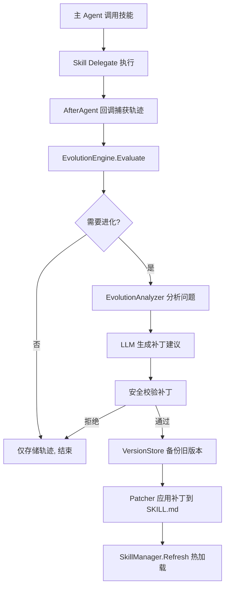

## 用户需求

为 Wukong Agent 平台添加技能进化功能，实现"使用中发现问题 → LLM 分析生成补丁 → 自动更新 SKILL.md → 下次使用改进后的技能"的完整自进化闭环。

## 核心功能

### 执行追踪

- 在技能子代理执行后，自动捕获执行轨迹：工具调用序列、各步骤成功/失败状态、最终输出质量、耗时等指标。
- 执行轨迹持久化到 SQLite，每条记录关联技能名称、会话 ID、时间戳。

### 问题分析

- 当技能执行出现错误（工具调用失败、结果为空、回复质量差）时，触发 LLM 分析流程。
- 分析流程使用独立的轻量模型，输入包含：技能 SKILL.md 原文、本次执行轨迹、错误信息。
- LLM 判断问题根源是否为技能指令缺陷（步骤过时、参数错误、缺少前置条件等）。

### 补丁生成与应用

- 若分析确认技能指令需要改进，由 LLM 生成 diff 格式的补丁建议。
- 补丁生成前先备份当前 SKILL.md 为版本化副本（`SKILL.v001.md`）。
- 补丁建议经安全性校验后自动应用到 SKILL.md 文件。
- 通过现有 `skill.Manager.Refresh()` 机制热加载更新后的技能。

### 版本管理

- 每次修补生成版本快照，保留最近 10 个历史版本。
- 支持查看版本差异和回滚到任意历史版本。
- 版本元数据（时间、触发原因、补丁摘要）存储在 SQLite。

### 配置控制

- 通过 config.yaml 的 `evolution` 配置段控制开关、分析模型、最小触发阈值、最大自动修补次数。

## 技术栈

- **语言**: Go 1.26
- **框架**: tRPC-Agent-Go v1.10.0（Agent 回调、Runner、Event）
- **存储**: SQLite（共享数据库池，新增 evolution_history 表）
- **文件系统**: 标准 `os` 包（SKILL.md 读写、版本备份）
- **配置**: Viper + YAML（EvolutionConfig）

## 实现方案

### 整体策略

不引入新的外部依赖，充分复用现有 Wukong 架构模式：

1. 新增 `internal/evolution/` 模块，封装全部进化逻辑
2. 通过现有的 `agent.AgentCallbacks` 回调链注入执行追踪
3. 复用现有 `util.DatabasePool` 共享 SQLite 连接存储版本历史
4. 复用 `provider.Factory` 创建分析用 LLM 模型
5. 通过现有 `skill.Manager.Refresh()` 实现热加载

### 架构设计



### 数据流

```
AfterAgentArgs → ExecutionTrace ← 事件聚合
    ↓
EvolutionEngine.Evaluate(trace)
    ├─ 检查错误/质量指标
    ├─ 检查冷却期 (同技能30分钟内不重复分析)
    └─ 检查修补次数上限
    ↓
Analyzer.Analyze(skillContent, trace) → LLM → PatchSuggestion
    ↓
Patcher.ApplyPatch(skillDir, skillName, patch)
    ├─ 备份 SKILL.md → SKILL.v003.md
    ├─ 写入更新的 SKILL.md
    └─ 记录版本元数据到 SQLite
    ↓
skill.Manager.Refresh() → FSRepository 重新索引
```

### 执行细节

#### 1. 回调注入点

在 `agent/loop.go` 的 `createSingleAgent()` 中，为技能子代理（`skill_` 前缀的 agent）注册扩展的 `AfterAgentCallback`：

```
// 在 buildAgentCallbacks 或新增 buildEvolutionCallbacks 中
callbacks.RegisterAfterAgent(func(ctx context.Context, args *agent.AfterAgentArgs) {
    if strings.HasPrefix(args.Invocation.AgentName, "skill_") {
        engine.RecordExecution(ctx, args)
    }
})
```

#### 2. 性能考量

- 轨迹分析使用独立的小模型（如 deepseek-chat），与主模型调用并发执行、互不阻塞
- 冷却期机制（30分钟）防止高频修补
- 异步分析：通过 goroutine + channel 异步触发，不影响主流程响应时间
- SQLite 版本表使用 WAL 模式，与现有数据库池共享连接

#### 3. 安全性

- 补丁必须通过 Security Guard 扫描（防止恶意指令注入）
- 补丁文件大小限制（默认 8KB）
- 自动修补次数上限（每技能 10 次/天）
- 所有补丁操作记录审计日志

### 目录结构

```
wukong/
├── internal/
│   ├── evolution/                      # [NEW] 进化引擎模块
│   │   ├── engine.go                   # EvolutionEngine — 主控制器
│   │   ├── analyzer.go                 # EvolutionAnalyzer — LLM 分析问题
│   │   ├── patcher.go                  # EvolutionPatcher — 应用补丁到文件
│   │   ├── store.go                    # VersionStore — SQLite 版本管理
│   │   └── types.go                    # 类型定义
│   ├── config/
│   │   └── config.go                   # [MODIFY] 添加 EvolutionConfig
│   ├── skill/
│   │   └── manager.go                  # [MODIFY] 扩展热加载、添加 evolution hook
│   ├── agent/
│   │   └── loop.go                     # [MODIFY] 注入 evolution 回调
│   └── cli/
│       └── session.go                  # [MODIFY] 初始化 EvolutionEngine
└── config.yaml                         # [MODIFY] 添加 evolution 配置段
```

### 关键代码结构

#### types.go — 类型定义

```
// ExecutionTrace 记录一次技能执行的完整轨迹
type ExecutionTrace struct {
    SkillName    string
    SessionID    string
    StartTime    time.Time
    EndTime      time.Time
    ToolCalls    []ToolCallRecord
    Error        string // 首个错误信息
    FinalOutput  string
    Success      bool
}

// ToolCallRecord 单次工具调用记录
type ToolCallRecord struct {
    Name     string
    Args     string
    Result   string
    Error    string
    Duration time.Duration
}

// PatchSuggestion LLM 生成的补丁建议
type PatchSuggestion struct {
    SkillName    string
    Reason       string // 修补原因
    DiffContent  string // 补丁内容
    Confidence   float64 // 置信度 0.0-1.0
    GeneratedAt  time.Time
}

// EvolutionConfig 进化系统配置
type EvolutionConfig struct {
    Enabled           bool          `mapstructure:"enabled"`
    AutoPatch         bool          `mapstructure:"auto_patch"`
    AnalysisModel     string        `mapstructure:"analysis_model"`
    MinConfidence     float64       `mapstructure:"min_confidence"`
    CooldownPeriod    time.Duration `mapstructure:"cooldown_period"`
    MaxPatchesPerDay  int           `mapstructure:"max_patches_per_day"`
    MaxVersionsKept   int           `mapstructure:"max_versions_kept"`
    PatchPromptFile   string        `mapstructure:"patch_prompt_file"`
}
```